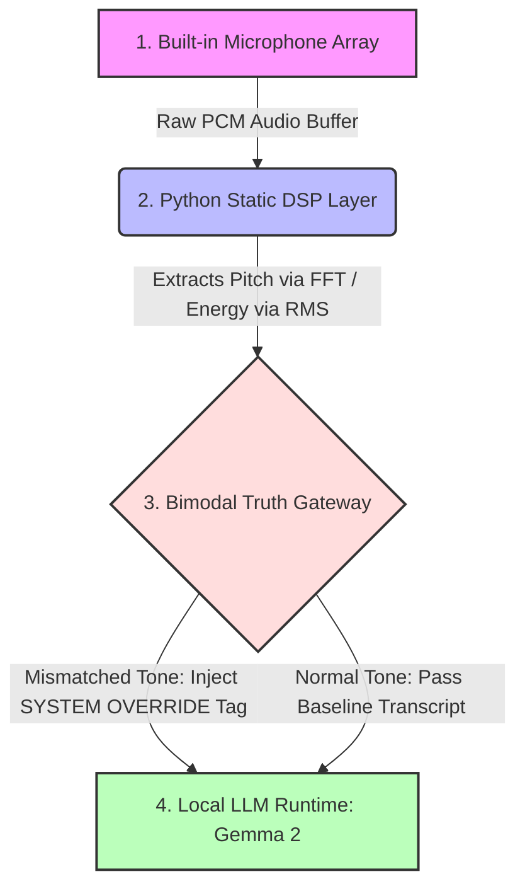

# 🚀 Project FREQUENCY: Low-Overhead Acoustic State Validation for Edge LLMs

### Project Concept
Modern edge language models (like Gemma) suffer from severe semantic bias—they rely entirely on the statistical probability of text tokens. When a user delivers a prompt with heavy contradiction (like deadpan sarcasm), text-only decoders take the words literally and hallucinate an incorrect contextual response.

Project FREQUENCY introduces a deterministic, out-of-model verification layer. Instead of routing heavy native audio streams through computationally expensive transformer layers—which drains device battery and wastes token context—this framework handles feature extraction at the hardware buffer level.

### How It Works
1. **Hardware-Isolated Physics Layer:** Implements a long-lived, persistent background input stream using `sounddevice` to completely bypass macOS privacy/blocking cycles.
2. **Zero-Cost Feature Extraction:** Uses programmatic Fast Fourier Transforms (FFT) and Root Mean Square (RMS) algorithms to instantly capture real-world voice pitch (Hz) and volume amplitude.
3. **Deterministic Truth Gateway:** A programmatic Python validation layer compares the literal text tokens against the physical acoustic metrics. If a structural mismatch is detected (e.g., highly enthusiastic text paired with low-amplitude, monotone pitch), the script intercepts the data packet.
4. **Context Injection:** Injects an explicit state constraint payload into a local model (Gemma 2 via Ollama) using only a few words worth of token overhead, successfully shattering the model's text bias and forcing an aligned, grounded response without wasting local VRAM.
## 🗺️ System Architecture Diagram

Below is the blueprint of how Project FREQUENCY processes physical bimodal inputs locally without transformer token overhead:

---
## 🛠️ Design Objectives & Edge-Computing Efficiencies

When streaming multi-modal inputs to local frontier models, processing raw audio streams inside a transformer's context window adds unnecessary latency. Project FREQUENCY implements a lightweight, local preprocessing pipeline to condition prompts based on physical acoustic features.

### 1. Reducing Context Window Load
Analyzing raw audio arrays natively inside a model's self-attention mechanism scales in computational complexity. 
* **The Implementation:** This script offloads basic feature extraction (volume estimation via RMS and frequency tracking via FFT peak detection) to the local CPU. By passing a lightweight text tag instead of raw audio data, we keep local model inference fast and responsive.

### 2. Local Hardware Isolation
Routing continuous microphone streams to cloud environments introduces data privacy risks and requires heavy network bandwidth.
* **The Implementation:** By isolating the audio buffer stream to the local hardware layer (`sounddevice`), the script ensures that feature checks happen strictly on-device. No raw audio ever leaves your machine.

### 3. Heuristic Prompt Conditioning
Text-based language models are inherently limited by literal interpretation. If a user inputs a text string reading *"I am fine,"* but their voice characteristics indicate an anomaly, a standard text pipeline misses the context.
* **The Implementation:** This framework acts as a basic deterministic heuristic check. It captures acoustic variances at the hardware layer and injects an explicit context tag (`[SYSTEM OVERRIDE]`) directly into the text prompt payload, providing the underlying model with immediate situational awareness.

---

## 🔬 Current Technical Limitations & Roadmap

As pointed out in initial technical reviews, the current implementation is an early-stage prototype with known engineering constraints:

* **FFT Peak Vulnerability:** The current pitch detection relies on basic Fast Fourier Transform (FFT) peak matching. This approach is highly sensitive to ambient background noise, room harmonics, and microphone artifacts, which can cause false positives.
* **Static Thresholding:** The override triggers rely on hardcoded numeric baselines.

### Next-Step Roadmap:
1. **Implement Robust Fundamental Frequency Estimation:** Transition from standard FFT peak selection to an established fundamental frequency estimation algorithm (like the YIN or pYIN algorithms) for accurate human vocal cord tracking.
2. **Dynamic Noise Floors:** Implement a rolling baseline calibration function to automatically adapt to ambient room noise and individual microphone sensitivities.
## 🎥 Live Project Demo

Click the badge below to watch the real-time processing and routing pipeline execution:

💡 **Demo Walkthrough Note:** *This screen recording demonstrates the local processing pipeline in real-time. In the first run, a normal vocal baseline is established at 157.38 Hz. In the second run, the vocal frequency drops to 136.26 Hz (simulating a flat, monotone delivery), automatically triggering the system logic gate and shifting Gemma's response matrix entirely on-device.*

### 🟢 Run 1: Genuine Vocal Baseline
* **Telemetry Data:** Pitch: `157.38 Hz` | Energy: `0.001 RMS`
* **Gemma 2 Response:** *"The sky must be particularly safe today, considering how uninspired the human condition appears to be."*

### 🔴 Run 2: Sarcastic Monotone Override
* **Telemetry Data:** Pitch: `136.26 Hz` | Energy: `0.024 RMS`
* **Gemma 2 Response (Overridden):** *"Delivering views of a Sunday afternoon assumes to be radiating from your voice like a poorly-tuned radio signal."*
