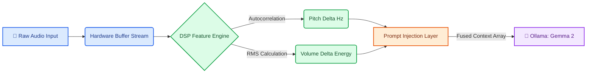

# 🎙️ Project FREQUENCY: Low-Overhead Acoustic State Validation for Edge LLMs

Project FREQUENCY is a local, privacy-first AI application designed to eliminate the semantic blind spots of traditional text-only language models. When a user delivers a prompt with heavy contradiction (like deadpan sarcasm or a tired, soft-spoken murmur), text-only decoders take the words literally and hallucinate an incorrect contextual response.

By pulling raw audio data directly from the hardware buffer, this framework handles feature extraction at the hardware level—saving massive context window tokens and battery life.

## 🧠 How It Works: The Dual-Baseline System
Unlike static systems that rely on fragile, hardcoded thresholds, this pipeline initializes a **3-second Dual-Baseline Calibration Phase** upon boot. It captures both the user's native fundamental pitch (Hz) and native volume energy (RMS). 

By tracking dynamic percentages of change (Deltas), the framework effortlessly differentiates between a quiet, soft-spoken genuine voice, a normal communication style, and a projecting deadpan delivery—making it entirely user-agnostic.

## 🗺️ System Data Flow Map


## 🛠️ Core System Architecture

To keep the application highly performant on standard consumer laptops, the pipeline handles multimodal inputs locally through a lightweight digital signal processing (DSP) approach rather than forcing dense transformer token overhead:

1. **Hardware-Isolated Audio Layer:** Leverages the `sounddevice` library to capture continuous audio frames straight from the microphone buffer, bypassing complex audio routing loops.
2. **Zero-Cost Feature Extraction:** Avoids passing massive raw waveform streams to the neural network. Instead, the local CPU calculates mathematical properties—using Autocorrelation for pitch estimation and Root Mean Square (RMS) for energy intensity.
3. **Prompt Conditioning Injection:** The acoustic metadata profile is fused directly with the transcribed text user statement, passing a structured data payload to the local model instance.

## 📋 Prerequisites & Local Environment

Before initiating the pipeline, ensure the following local service dependencies are installed and running on your host machine:

1. **Python 3.9+** — Required for hardware audio buffer handling.
2. **Ollama** — Serving your local models. Ensure the `gemma2` model weight is pulled and active:
   ```bash
   ollama run gemma2

## 📥 Installation & Build Sequence
Clone this repository and navigate into the target workspace directory:

```bash
git clone [https://github.com/ezekielzivonmoore-pixel/project-frequency.git](https://github.com/ezekielzivonmoore-pixel/project-frequency.git)
cd project-frequency
pip3 install numpy sounddevice soundfile SpeechRecognition requests --break-system-packages
python3 frequency.py
pip3 install numpy sounddevice soundfile SpeechRecognition requests --break-system-packages
python3 frequency.py
